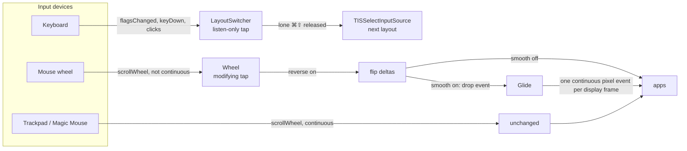

<p align="center">
  <picture>
    <source media="(prefers-color-scheme: dark)" srcset="design/logo-dark.svg">
    
  </picture>
</p>

<h1 align="center">Swivel</h1>

<p align="center">
  A tiny, free macOS menu-bar app for people who switch keyboard layouts and use a plain mouse.<br>
  <b>Command + Shift layout switching · smooth mouse wheel scrolling · mouse wheel reversal</b><br>
  macOS 14+ · Apple Silicon · Swift · no dependencies · public domain
</p>

---

## Contents

- [Why Swivel exists](#why-swivel-exists)
- [What Swivel does](#what-swivel-does)
- [Quick start](#quick-start)
- [Installation](#installation)
- [Using Swivel](#using-swivel)
- [Permissions](#permissions)
- [Smooth scrolling settings](#smooth-scrolling-settings)
- [How it works](#how-it-works)
- [Project layout](#project-layout)
- [Stored preferences](#stored-preferences)
- [Debugging and logs](#debugging-and-logs)
- [Troubleshooting](#troubleshooting)
- [Known limitations](#known-limitations)
- [Uninstall](#uninstall)
- [Notes for AI agents and contributors](#notes-for-ai-agents-and-contributors)
- [FAQ](#faq)
- [License](#license)

## Why Swivel exists

Swivel was made for one everyday setup: a Mac, two (or more) keyboard languages, and an ordinary mouse with a clicky wheel. Out of the box, macOS handles all three of those a little awkwardly, and fixing them used to take several separate, often paid or heavyweight utilities. Swivel fixes exactly these three annoyances in one small, free app and does nothing else.

### Pain 1: switching keyboard layouts is clumsy

If you write in two languages, say English and Russian, you switch layouts dozens or hundreds of times a day. macOS offers Control + Space or the Globe key. Control + Space collides with shortcuts in IDEs, terminals and design tools; the Globe key is missing on many external keyboards; and people coming from Windows or Linux have years of muscle memory for a Shift-based combination.

**What Swivel does about it:** a quick tap of Command + Shift switches the layout. Because the switch happens only when both keys are released *and nothing else was pressed*, it never interferes with the many ⌘⇧ shortcuts (⌘⇧T, ⌘⇧4, ⌘⇧Z and so on). You get a fast, one-handed toggle that stays out of the way.

### Pain 2: a normal mouse wheel scrolls in jerks

Trackpads and the Magic Mouse scroll smoothly. Almost every other mouse, especially gaming and office mice with a notched ("clicky") wheel, does not: each notch makes the page jump a few lines. Reading long pages, code or documents becomes tiring, because the eye loses its place at every jump. macOS has no setting to change this.

Simple smoothing tools help when you spin the wheel quickly, but when you scroll slowly, which is how most people read, the page visibly surges and brakes with every notch.

**What Swivel does about it:** it turns each notch into a short glide and, crucially, learns the rhythm of your wheel so that slow, steady scrolling becomes slow, steady movement, not a series of pulses. Three sliders let you set how far a notch goes, how much fast spinning speeds things up, and how long the glide lasts.

### Pain 3: one scroll direction for two very different devices

macOS has a single "natural scrolling" switch for both the trackpad and the mouse. Many people want natural scrolling on the trackpad (content follows the fingers) but the traditional direction on a mouse wheel, or the other way round. With one switch, one of the two always feels backwards.

**What Swivel does about it:** it can reverse only the mouse wheel. The trackpad keeps the system setting.

### Who it is for

- People who type in more than one language every day and want a quick, conflict-free layout toggle.
- Anyone using a non-Apple mouse on a Mac: gamers, developers, designers, office users, people with a desktop Mac and an external mouse.
- People who move between a MacBook trackpad and a desk mouse and want each to scroll the way it feels right.
- Anyone who prefers a tiny, transparent, dependency-free tool over a large utility suite: about 700 lines of Swift, no network access, no telemetry, public domain.

## What Swivel does

Swivel lives in the menu bar and offers three independent features. Each one is a toggle in its menu.

| Feature | What you get | Default | Permission |
|---|---|---|---|
| **Switch Layout with ⌘⇧** | Press and release Command + Shift on their own, and the next keyboard input source (layout) is selected. Shortcuts that use Command + Shift *with another key*, such as ⌘⇧T or ⌘⇧4, keep working and do not switch. | On | Input Monitoring |
| **Smooth Scrolling** | A notched mouse wheel (gaming, office, most non-Apple mice) normally jumps line by line. Swivel turns every notch into a steady, eased glide that keeps an even pace, including when you turn the wheel slowly. | Off | Accessibility |
| **Reverse Mouse Wheel** | A plain mouse scrolls in the opposite direction, while the trackpad keeps the system's "natural scrolling" setting. | Off | Accessibility |

Trackpads, the Magic Mouse and other devices that already scroll continuously are never touched by the scroll features.

Swivel has no network code, no telemetry, no updater and no analytics. It never stores or sends what you type. It runs in the App Sandbox with no file-access exceptions.

## Quick start

```sh
git clone https://github.com/cioxideru/swivel.git
cd swivel
./build.sh
cp -R build/Swivel.app /Applications/
open /Applications/Swivel.app
```

Then open the Swivel menu (two arrows around a small pill in the menu bar), grant the permissions it asks for, and switch on the features you want.

## Installation

### Requirements

- macOS 14 Sonoma or later. On macOS 26 and later the app icon follows the light and dark system appearance.
- An Apple Silicon Mac (arm64).
- Xcode 26 or later, for `swiftc` and `actool` (the app icon is an Icon Composer `.icon` file). Command Line Tools alone are not enough because `actool` ships with Xcode.

### Build from source

```sh
./build.sh
```

The script compiles `Sources/*.swift` with `swiftc`, assembles `build/Swivel.app`, compiles the app icon with `actool`, copies the menu-bar icon, and code-signs the bundle with the hardened runtime and the sandbox entitlement. Nothing is downloaded during the build.

### Signing and why it matters

macOS ties privacy permissions (Input Monitoring, Accessibility) to the app's code signature.

- **Ad hoc signing (default).** `./build.sh` signs with `-`. Every rebuild produces a new signature, so macOS treats each build as a different app and the permissions must be granted again.
- **Signing with your certificate (recommended for anyone who rebuilds).** Pass a code-signing identity; the permissions then survive rebuilds:

  ```sh
  security find-identity -v -p codesigning        # list your identities
  SIGN_IDENTITY="Apple Development: you@example.com (TEAMID)" ./build.sh
  ```

  A free Apple Development certificate (created by Xcode for your Apple ID) is enough.

### Install

```sh
cp -R build/Swivel.app /Applications/
open /Applications/Swivel.app
```

To start Swivel automatically, add it in **System Settings → General → Login Items & Extensions → Open at Login**.

### Updating

Quit Swivel from its menu, replace `/Applications/Swivel.app` with the new build, and open it again. If the new build has a different signature than the old one, see [Permissions](#permissions).

### Coming from CommandShift or another layout switcher

Do not run two Command + Shift switchers at the same time, or each press switches twice. Quit the other app (and remove it from Login Items) before using Swivel.

## Using Swivel

The menu contains:

| Item | What it does |
|---|---|
| **Switch Layout with ⌘⇧** | Toggles layout switching. |
| **Smooth Scrolling** | Toggles smooth scrolling for notched wheels. |
| **Reverse Mouse Wheel** | Toggles wheel reversal. Works with or without smooth scrolling. |
| **Smooth Scrolling Settings…** | Opens the sliders window, see [below](#smooth-scrolling-settings). |
| **Input Monitoring: Allowed / Allow…** | Shown while layout switching is on. |
| **Accessibility: Allowed / Allow…** | Shown while a scroll feature is on. |
| **About Swivel** | Version, short description, license, project link. |
| **Quit Swivel** (⌘Q) | Quits the app. |

The menu-bar icon is drawn dimmed while an enabled feature is waiting for a permission.

### Layout switching rules

- Press Command and Shift (in any order), then release both. The next enabled keyboard input source is selected, wrapping around at the end of the list.
- Pressing any other key, clicking a mouse button, or adding Control, Option or Fn while Command + Shift are held cancels the switch until all modifiers are released.
- The switch happens on release, so ⌘⇧-shortcuts never trigger it.
- The cycle follows the order of **System Settings → Keyboard → Text Input → Input Sources**.

## Permissions

| Permission | Needed for | Why | What Swivel can do with it |
|---|---|---|---|
| **Input Monitoring** | Layout switching | To see a lone Command + Shift press. | A *listen-only* event tap receives modifier changes, key-down events and mouse-button presses. It cannot change or block them, and it records nothing. Key codes are never read. |
| **Accessibility** | Smooth scrolling, wheel reversal | macOS allows changing input events only with this permission. | A separate event tap receives **scroll-wheel events only**. It flips their sign (reversal) or replaces them with smooth scroll events. It never sees keyboard events. |

How Swivel handles permissions:

1. When you turn on a feature that needs a permission, Swivel shows the system prompt once.
2. The menu shows **Allowed** or **Allow…** for each permission an enabled feature needs.
3. While something is missing, Swivel retries every 1.5 seconds, so a permission granted in System Settings takes effect within a couple of seconds, without restarting the app.
4. Clicking **Allow…** again opens a short explanation with **Open System Settings** and **Copy Command** buttons.

Swivel checks a permission by actually creating its event tap, because that is the only reliable signal: the system's "is it granted?" calls can disagree with what really works.

### "System Settings says allowed, but Swivel still asks"

The entry in System Settings belongs to an older copy of the app with a different signature (typical after an ad hoc rebuild). Fix it in either way:

- In **System Settings → Privacy & Security → Input Monitoring** (or **Accessibility**), select Swivel, remove it with **−**, then add `/Applications/Swivel.app` again with **+**.
- Or reset the entry in Terminal and grant it again when Swivel asks:

  ```sh
  tccutil reset ListenEvent io.github.cioxideru.swivel     # Input Monitoring
  tccutil reset Accessibility io.github.cioxideru.swivel   # Accessibility
  ```

The **Copy Command** button in Swivel copies the right line for you.

## Smooth scrolling settings

**Smooth Scrolling Settings…** opens a small window. Changes apply immediately, so keep the window open, scroll in another app, and adjust until it feels right.

| Slider | Range | Default | Effect |
|---|---|---|---|
| **Speed** | 30–240 pt per notch | 90 | How far one wheel notch scrolls. |
| **Acceleration** | Off – 8× | 4× | Extra distance when the wheel spins fast. The boost starts above 12 notches per second and grows with the spin rate, up to the chosen maximum. "Off" keeps every notch the same length. |
| **Glide** | 150–1100 ms | 470 ms | How long the page keeps moving after the last notch. Lower feels tighter and more direct; higher feels softer, with more inertia. |

**Restore Defaults** returns all three to their defaults.

Tips:

- Scrolling feels too slow when you turn the wheel slowly → raise **Speed**.
- Long pages take too many turns → raise **Acceleration**.
- Scrolling feels laggy or keeps going too long → lower **Glide**.
- Some jerkiness remains when slowing down → raise **Glide** a little.

## How it works

### Overview



Both taps are Quartz event taps (`CGEvent.tapCreate`) at the session level, inserted at the head, running on the main run loop. If macOS disables a tap because a callback took too long, `EventTap` re-enables it immediately.

### Layout switching (`Sources/LayoutSwitcher.swift`)

A small state machine with three states: `idle`, `armed` and `cancelled`.

- Modifiers change to exactly Command + Shift while `idle` → `armed`.
- Control, Option or Fn joins → `cancelled`.
- A key-down or mouse-button press while `armed` → `cancelled`.
- All modifiers released → if `armed`, select the next input source; then `idle`.

The next source comes from `TISCreateInputSourceList` filtered to enabled, selectable keyboard input sources; the current source is found with `TISCopyCurrentKeyboardInputSource`, and `TISSelectInputSource` selects the one after it.

### Telling a wheel from a trackpad

A notched wheel produces scroll events with `scrollWheelEventIsContinuous == 0`. Trackpads, the Magic Mouse, and Swivel's own synthetic events are continuous (`1`) and pass through untouched. This single check also keeps Swivel from processing its own output.

### Wheel reversal (`Wheel.flip`)

For both axes Swivel negates the line delta, the fixed-point delta, the point (pixel) delta, and the accelerated and raw deltas (fields 175–178). The line delta is written first because writing it makes macOS recompute the fixed-point and point deltas; those are restored, negated, right after.

### Smooth scrolling (`Glide` in `Sources/Wheel.swift`)

**The problem.** A simple smoother moves the page by a fraction of the remaining distance each frame. Speed is then proportional to the distance left, so every notch makes the speed jump and it decays until the next one. When the wheel turns fast, the notches merge and it looks fine. When it turns slowly (150–300 ms between notches), the page visibly speeds up and slows down with every notch.

**The fix, in two stages.**

1. **Even release, paced by the wheel's rhythm.** Every notch adds travel to an "owed" amount instead of moving the target at once. Swivel keeps a smoothed estimate of the time between notches (`interval`, blended 50/50 with each new gap) and releases the owed travel at a constant speed:

   ```
   releaseSpeed = |owed| / (interval × 1.25)
   ```

   With evenly spaced notches this gives a perfectly constant target speed. The factor 1.25 releases a little slower than the rhythm, so when you gradually slow down the owed travel does not run out before the next notch arrives (otherwise the page would briefly stop and restart).

2. **A critically damped spring follows the target.** The visible position chases the released target as a spring with stiffness ω and critical damping. It has no overshoot, and its velocity is continuous, so even sudden changes in pace only change acceleration. Swivel uses the exact closed-form step, which is stable for any frame length:

   ```
   e  = position − target          (offset)
   d  = v + ω·e
   e' = (e + d·Δt) · exp(−ω·Δt)
   v' = (v − ω·d·Δt) · exp(−ω·Δt)
   ```

   The **Glide** slider sets ω: a critically damped spring is within 1% of its target after about 6.64/ω seconds, so `ω = 6.64 / glideTime`.

**Per notch:**

```
travel = speed × clamp(1 / (interval × 12), 1, acceleration)
```

So acceleration starts once the wheel spins faster than 12 notches per second. A reversal of direction drops the old motion immediately. A pause longer than 0.4 s forgets the rhythm, and the first notch of a new gesture assumes a 120 ms interval.

**Per frame:** a `CADisplayLink` from the screen under the cursor drives the animation at the display's refresh rate (up to 120 Hz on ProMotion), so exactly one scroll event lands in every frame. Each frame posts one continuous pixel-unit scroll event at `kCGSessionEventTap` with the current modifier flags (so ⌘-scroll zoom and ⇧-scroll keep working). Whole points go into the point delta and the remaining fraction is carried to the next frame. The exact fractional step also goes into the fixed-point delta, which counts in tenths of a point. The display link stops once the target is reached and the spring has settled.

Measured on a model of the algorithm (steady notches every 200 ms): the old exponential smoother swung between 260 and 724 pt/s within every notch; Swivel's glide holds a constant 450 pt/s.

### Constants that are not exposed as sliders

They live at the top of `Glide`:

| Constant | Value | Meaning |
|---|---|---|
| `boostRate` | 12 notches/s | Spin rate where acceleration begins. |
| `slack` | 1.25 | Release over 125% of the expected interval. |
| `firstInterval` | 0.12 s | Assumed interval before a rhythm is known. |
| `minInterval` | 0.008 s | Lower bound for a measured gap. |
| `maxInterval` | 0.4 s | A longer pause starts a new gesture. |
| `intervalBlend` | 0.5 | Weight of the newest gap in the interval estimate. |

## Project layout

```
swivel/
├── Sources/
│   ├── main.swift            App delegate: menu, toggles, permission UI, retry timer, About panel
│   ├── EventTap.swift        Small wrapper around CGEvent.tapCreate with automatic re-enable
│   ├── LayoutSwitcher.swift  Command + Shift state machine and input-source cycling (Carbon TIS)
│   ├── Wheel.swift           Wheel (tap, wheel detection, reversal), GlideTuning, Glide (smooth scrolling)
│   ├── ScrollSettings.swift  Stored slider values and the settings window
│   └── Permission.swift      Input Monitoring / Accessibility checks, prompts, Settings links, reset command
├── Resources/
│   ├── Info.plist            Bundle metadata (LSUIElement: menu-bar only, no Dock icon)
│   ├── Swivel.entitlements   App Sandbox, nothing else
│   ├── AppIcon.icon/         Icon Composer icon: light, dark and tinted appearances
│   └── StatusIcon*.png       Menu-bar template icon (1x, 2x)
├── design/
│   ├── logo-light.svg        Day logo (README, icon source)
│   ├── logo-dark.svg         Night logo
│   ├── status-template.svg   Menu-bar glyph source
│   └── render.swift          SVG → PNG helper: swift design/render.swift in.svg out.png size
├── build.sh                  Build, bundle, icon compile and code signing
├── LICENSE                   The Unlicense (public domain)
└── README.md
```

About 700 lines of Swift in total. There is no Xcode project, Swift package or third-party dependency; `build.sh` calls the compiler directly.

### Bundle facts

| Key | Value |
|---|---|
| Bundle identifier | `io.github.cioxideru.swivel` |
| Executable | `Swivel` |
| Minimum macOS | 14.0 |
| Architecture | arm64 |
| Menu-bar only | `LSUIElement = true` |
| Sandbox | Yes, no exceptions |
| Frameworks | AppKit, CoreGraphics, Carbon (TIS), QuartzCore, os |

## Stored preferences

All settings are kept in the app's own user defaults (inside its sandbox container) and are changed through the menu and the settings window.

| Key | Type | Default | Meaning |
|---|---|---|---|
| `SwitchLayout` | Bool | `true` | Layout switching on/off |
| `SmoothScrolling` | Bool | `false` | Smooth scrolling on/off |
| `ReverseWheel` | Bool | `false` | Wheel reversal on/off |
| `ScrollSpeed` | Double | `90` | Points per notch |
| `ScrollAcceleration` | Double | `4` | Maximum boost, `1` = off |
| `ScrollGlideTime` | Double | `0.47` | Seconds until the glide settles |
| `RequestedInput Monitoring`, `RequestedAccessibility` | Bool | — | The system prompt was already shown once |

Read them from Terminal (macOS may require Terminal to have access to the container):

```sh
defaults read io.github.cioxideru.swivel
```

## Debugging and logs

Smooth scrolling writes a debug-level line for every notch it receives (axis, gap since the previous notch, the rhythm interval in use, the boost). Debug messages are not stored, so stream them live while you scroll:

```sh
log stream --level debug --predicate 'subsystem == "io.github.cioxideru.swivel"'
```

Check permission decisions made by macOS:

```sh
log show --last 10m --predicate 'process == "tccd" AND eventMessage CONTAINS "swivel"' --style compact
```

A line like `Failed to match existing code requirement` means the stored permission belongs to an older signature; see [Permissions](#permissions).

## Troubleshooting

| Symptom | Cause | Fix |
|---|---|---|
| Menu shows **Allow…** although System Settings shows Swivel as allowed | Stale entry from an older build | Remove and re-add Swivel in System Settings, or run the `tccutil reset` command (menu → Allow… → Copy Command). |
| Permissions disappear after every rebuild | Ad hoc signing | Build with `SIGN_IDENTITY=…`, see [Signing](#signing-and-why-it-matters). |
| Layout switches twice | Another Command + Shift switcher is running | Quit the other app. |
| ⌘⇧ does nothing | Input Monitoring missing, the feature is off, or only one input source is enabled | Check the menu; add a second input source in Keyboard settings. |
| Wheel scrolling unchanged with Smooth Scrolling on | Accessibility missing, or the device is continuous (trackpad, Magic Mouse, Logitech software smoothing) | Check the menu; continuous devices are intentionally left alone. |
| Scrolling too fast or too slow | Taste | Adjust **Speed** and **Acceleration** in the settings window. |
| Page keeps moving too long | Taste | Lower **Glide**. |
| Icon in the menu bar is dimmed | An enabled feature is waiting for a permission | Open the menu and click **Allow…**. |
| App icon does not switch with dark mode | macOS 14/15 | Light and dark app icons need macOS 26 or later; the menu-bar icon adapts on all versions. |

## Known limitations

- Only notched wheels are smoothed. Devices that already send continuous scroll events are passed through unchanged; this includes the Magic Mouse and mice whose vendor software already smooths scrolling.
- Smooth scrolling does not send trackpad gesture phases, so apps do not show rubber-band overscroll at the end of a page for wheel scrolling.
- The display link follows the screen under the pointer when a glide starts; on setups that mix 60 Hz and 120 Hz displays, a glide that crosses screens keeps the first screen's rate until it ends.
- Layout switching cycles forward only.
- Apple Silicon and macOS 14+ only.

## Uninstall

```sh
osascript -e 'quit app "Swivel"'
rm -rf /Applications/Swivel.app
tccutil reset ListenEvent io.github.cioxideru.swivel
tccutil reset Accessibility io.github.cioxideru.swivel
rm -rf ~/Library/Containers/io.github.cioxideru.swivel
```

## Notes for AI agents and contributors

- **Start here:** `Sources/Wheel.swift` for scrolling, `Sources/LayoutSwitcher.swift` for the keyboard, `Sources/main.swift` for the menu and permissions flow.
- **Build check:** `./build.sh` must finish without warnings. There is no test target; the logic has no external dependencies and can be exercised by building and running the app.
- **Threading:** everything runs on the main thread. Event taps, the display link and the retry timer are all scheduled on the main run loop, so no locks are needed. Keep tap callbacks short; macOS disables a tap whose callback is slow.
- **Do not process your own events:** synthetic scroll events must stay continuous (`scrollWheelEventIsContinuous = 1`); that is how the tap recognizes and skips them.
- **Field write order matters:** writing a scroll event's line delta makes macOS recompute its fixed-point and point deltas. Write the line delta first.
- **Units:** the point delta is in points (integer); the fixed-point delta is in tenths of a point for pixel-unit events (an 8 pt event carries 0.8).
- **Permissions are per signature:** any rebuild with a different signature looks like a new app to macOS. Use a stable `SIGN_IDENTITY` while developing.
- **Tuning:** user-facing values belong in `GlideTuning` and `ScrollSettings`; fixed internals stay as constants in `Glide`. Keep the closed-form spring step; a naive Euler step becomes unstable at long frames.
- **Scope:** Swivel deliberately stays small. Prefer system APIs over dependencies and keep features toggleable.

## FAQ

**Is it safe? Does it log my keystrokes?**
No. The keyboard tap is listen-only, reads only modifier flags and the fact that *some* key went down, and stores nothing. There is no network code at all. The source is about 700 lines; read it.

**Why does Swivel need Accessibility just for scrolling?**
Changing or replacing input events requires it on macOS. The tap that uses it receives only scroll-wheel events.

**Does it work with the Magic Mouse or a trackpad?**
They already scroll smoothly and are passed through untouched. Reversal applies only to notched wheels, so the trackpad keeps its own direction.

**Can I switch layouts with a different shortcut?**
Not at the moment; Swivel does one shortcut well. The state machine in `LayoutSwitcher.swift` is easy to adapt.

**Does it work on Intel Macs or macOS 13?**
No. It targets arm64 and macOS 14+ (the per-screen display link it uses for smooth scrolling arrived in macOS 14).

## License

Public domain, under [The Unlicense](LICENSE). Use it, change it, sell it, ship it under your own name. No credit needed.
