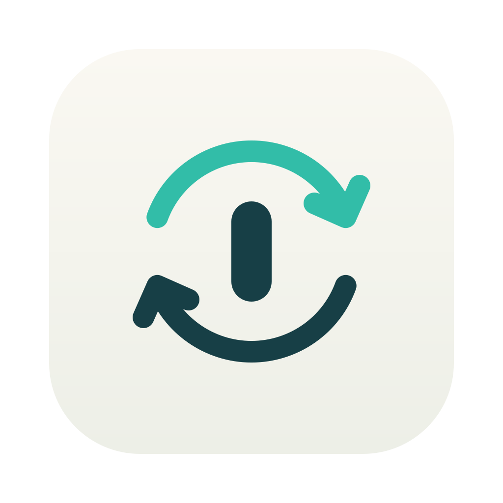

<p align="center">
  <picture>
    <source media="(prefers-color-scheme: dark)" srcset="design/logo-dark.svg">
    
  </picture>
</p>

<h1 align="center">Swivel</h1>

<p align="center">A tiny macOS menu-bar app for people who switch keyboard layouts and use a plain mouse.</p>

## What it does

- **Switch Layout with ⌘⇧.** Press and release Command + Shift on their own, and the next keyboard input source is selected. Shortcuts that use Command + Shift together with another key, such as ⌘⇧T, keep working as usual.
- **Smooth Scrolling.** A notched (gaming or office) mouse wheel jumps line by line. Swivel turns each notch into a steady glide that keeps an even pace, also when you turn the wheel slowly. Trackpads and the Magic Mouse are left alone.
- **Reverse Mouse Wheel.** Scroll a plain mouse in the opposite direction while the trackpad keeps the system setting.

Each feature is a toggle in the menu. Swivel has no settings window, no network access, no telemetry, and it never stores what you type.

## Permissions

macOS asks for one permission per kind of feature:

- **Input Monitoring** for layout switching. A passive listener watches modifier keys to see a lone Command + Shift. It cannot change or block keystrokes.
- **Accessibility** for smooth scrolling and wheel reversal, because changing scroll events requires it. Only scroll events are touched.

The menu shows the state of each permission and an **Allow…** item when one is missing. Swivel picks up a newly granted permission within a couple of seconds, without a restart. If System Settings shows Swivel as allowed but the menu still asks for it, that entry belongs to an older copy of the app: remove Swivel from the list with **−** and add it again, or run the `tccutil reset` command the menu offers to copy.

## Requirements

macOS 14 or later on Apple Silicon.

## Build

You need Xcode (for `swiftc` and `actool`).

```sh
./build.sh
```

The app appears in `build/Swivel.app`; move it to `/Applications`. Builds are signed ad hoc by default, which makes macOS forget the permissions after every rebuild. To keep them, sign with your own certificate:

```sh
SIGN_IDENTITY="Apple Development: you@example.com (TEAMID)" ./build.sh
```

## How the smooth scrolling works

Each wheel notch adds a fixed amount of travel, more when the wheel spins fast. Swivel learns the rhythm of your notches and releases that travel evenly over the time it expects until the next notch, so a steady hand gives a steady speed instead of a jolt per notch. The screen follows the released travel on a critically damped spring, which changes speed smoothly and never overshoots. One scroll event is sent per display refresh, and sub-pixel fractions are carried over instead of being lost. The tuning constants sit at the top of `Glide` in `Sources/Wheel.swift`.

## License

Public domain ([The Unlicense](LICENSE)). Use it, change it, sell it, ship it under your own name. No credit needed.
